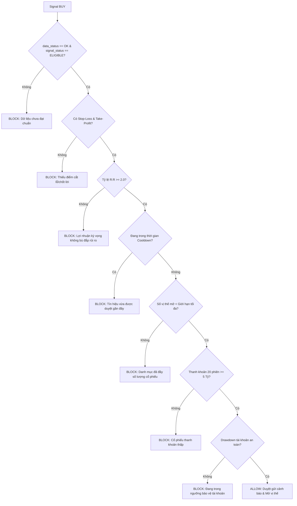

# 🛡️ FinShield - Hệ Thống Tín Hiệu & Quản Trị Rủi Ro Chứng Khoán Việt Nam

> **DNSE Quantitative Trading Signal Engine & Intelligent Telegram Bot Platform**
> *Thu thập dữ liệu đa nguồn • Kiểm định chất lượng không khoan nhượng • Phân tích định lượng đa chiều • Cổng quản trị rủi ro đa tầng • Bắn cảnh báo tự động qua Telegram.*

---

## 📌 Mục Lục

- [1. Giới thiệu Tổng quan](#1-giới-thiệu-tổng-quan)
- [2. Triết lý Thiết kế &amp; Nguyên tắc Bất biến](#2-triết-lý-thiết-kế--nguyên-tắc-bất-biến)
- [3. Kiến trúc Hệ thống &amp; Luồng Dữ liệu](#3-kiến-trúc-hệ-thống--luồng-dữ-liệu)
- [4. Các Tính năng Nổi bật](#4-các-tính-năng-nổi-bật)
- [5. Cấu trúc Thư mục Dự án](#5-cấu-trúc-thư-mục-dự-án)
- [6. Hướng dẫn Cài đặt Chi tiết (Step-by-Step)](#6-hướng-dẫn-cài-đặt-chi-tiết-step-by-step)
- [7. Hướng dẫn Vận hành &amp; Chạy Hệ thống](#7-hướng-dẫn-vận-hành--chạy-hệ-thống)
- [8. Cẩm nang Lệnh Telegram Bot (FinShield Bot)](#8-cẩm-nang-lệnh-telegram-bot-finshield-bot)
- [9. Đặc tả Động cơ Tín hiệu &amp; Cổng Quản trị Rủi ro](#9-đặc-tả-động-cơ-tín-hiệu--cổng-quản-trị-rủi-ro)
- [10. Kiểm thử Tự động &amp; Backtesting](#10-kiểm-thử-tự-động--backtesting)
- [11. Xử lý Sự cố Thường gặp (Troubleshooting)](#11-xử-lý-sự-cố-thường-gặp-troubleshooting)
- [12. Tuyên bố Miễn trừ Trách nhiệm (Disclaimer)](#12-tuyên-bố-miễn-trừ-trách-nhiệm-disclaimer)

---

## 1. Giới thiệu Tổng quan

**FinShield** là nền tảng phân tích định lượng (Quantitative Trading) và cảnh báo tín hiệu đầu tư chứng khoán tự động dành cho thị trường Việt Nam (HOSE, HNX, UPCOM). Hệ thống kết nối trực tiếp với **DNSE OpenAPI** để lấy dữ liệu realtime từng giây, đồng bộ dữ liệu Báo cáo tài chính (BCTC) và dòng tiền khối ngoại, chạy mô hình phân tích kỹ thuật kết hợp cấu trúc dòng tiền lớn (Order Block / Smart Money Concept), sau đó sàng lọc qua **Cổng Quản Trị Rủi Ro (Risk Gate)** trước khi gửi khuyến nghị tới nhà đầu tư qua Telegram Bot.

### Điểm khác biệt của FinShield:

- **Không bao giờ sinh tín hiệu ảo trên dữ liệu lỗi:** Nếu dữ liệu bị chậm, thiếu hoặc mâu thuẫn giữa các nguồn, hệ thống tự động khóa lệnh MUA (`NO SIGNAL`), bảo vệ vốn an toàn tuyệt đối.
- **Tách bạch hoàn toàn Signal Engine và Risk Gate:** Chiến lược tìm kiếm cơ hội, nhưng Cổng rủi ro mới là bên quyết định có cho phép giải ngân hay không (kiểm tra tỷ lệ R:R $\ge 2.0$, số lượng vị thế, thanh khoản 20 phiên, giới hạn sụt giảm tài khoản).
- **Trải nghiệm Telegram tương tác cao cấp:** Hỗ trợ tra cứu tức thì (`/check`), soi vùng cản/gom hàng (`/block`), vẽ biểu đồ nến tự động gửi kèm ảnh (`/chart`), quét danh mục cá nhân và tự động "bắn" cảnh báo ngầm trong phiên khi xuất hiện điểm nổ.

---

## 2. Triết lý Thiết kế & Nguyên tắc Bất biến

> [!IMPORTANT]
> **Nguyên tắc số 1:** *Giá không đủ tin cậy thì hệ thống KHÔNG ĐƯỢC PHÉP tạo BUY/SELL.*
> Dữ liệu cơ bản, chỉ số thị trường hoặc giao dịch khối ngoại bị thiếu sẽ **chặn mở vị thế BUY mới**, nhưng **tuyệt đối không được làm mất tín hiệu SELL bảo vệ vị thế** khi giá realtime vẫn còn mới và hợp lệ.

Hệ thống quản lý nghiêm ngặt 3 trạng thái xuyên suốt toàn bộ pipeline:

| Trạng thái      | Giá trị hợp lệ                               | Ý nghĩa nghiệp vụ                                                                |
| ----------------- | ------------------------------------------------ | ------------------------------------------------------------------------------------ |
| `data_status`   | `OK` \| `DATA WARNING`                       | Đánh giá tính toàn vẹn, độ trễ và độ tin cậy của dữ liệu đầu vào. |
| `signal_status` | `ELIGIBLE` \| `NO SIGNAL`                    | Đánh giá điều kiện kỹ thuật & cơ bản của chiến lược.                   |
| `action`        | `BUY` \| `SELL` \| `HOLD` \| `NO SIGNAL` | Hành động khuyến nghị cuối cùng sau khi qua Risk Gate.                        |
| `risk_decision` | `ALLOW` \| `BLOCK`                           | Quyết định của Cổng Quản trị Rủi ro kèm lý do chi tiết.                   |

**Quy tắc chuyển dịch:**

- **Entry Gate (Mở vị thế BUY):** Chỉ kích hoạt khi đồng thời thỏa mãn: `data_status = OK` VÀ `signal_status = ELIGIBLE` VÀ `Risk Gate = ALLOW`.
- **Exit/Risk Gate (Đóng vị thế SELL):** Ưu tiên hàng đầu cho việc bảo toàn vốn (Stop-Loss chạm ngưỡng hoặc Take-Profit đạt mục tiêu). Bất kể dữ liệu BCTC có trễ hay không, nếu giá realtime hợp lệ, lệnh SELL vẫn được bảo vệ thực thi.

---

## 3. Kiến trúc Hệ thống & Luồng Dữ liệu

```
┌─────────────────────────────────────────────────────────────────────────┐
│                           NGUỒN DỮ LIỆU ĐẦU VÀO                         │
│   • DNSE OpenAPI (Giá realtime, OHLCV lịch sử, GD Khối ngoại 5 phiên)   │
│   • Vnstock/ Vnfinancialdata / VCI / KBS (Báo cáo tài chính quý/năm,    │
│   Chỉ số cơ bản)                                                        │       
└────────────────────────────────────┬────────────────────────────────────┘
                                     │
                                     ▼
┌─────────────────────────────────────────────────────────────────────────┐
│                    THU THẬP DỮ LIỆU (DATA CRAWLERS)                     │
│  [collectors_processing/dnse_api_crawl.py & hybrid_fundamental.py]      │
│   • Retry cơ chế Exponential Backoff • Fallback nguồn dự phòng          │
│   • Chống look-ahead bias (Ước tính ngày công bố BCTC +30 ngày)         │
└────────────────────────────────────┬────────────────────────────────────┘
                                     │
                                     ▼
┌─────────────────────────────────────────────────────────────────────────┐
│                   KIỂM ĐỊNH & PHÂN TÍCH (ANALYTICS ENGINE)              │
│  [collectors_processing/analytics.py]                                   │
│   • Data Quality Gate (Lọc NaN, Anomaly, Stale Data)                    │
│   • 15+ Chỉ báo Kỹ thuật (SMA, EMA, RSI, MACD, BB, ATR, ADX, Stoch)     │
│   • Chỉ số Tài chính (ROE TTM 4 quý, P/E, P/B, Debt/Equity)             │
│   • Order Block Detection (Vùng gom Bullish OB, Vùng cản Bearish OB)    │
│   • Lưu trữ: SQLite (market_analytics.sqlite) & Quality Report JSON     │
└────────────────────────────────────┬────────────────────────────────────┘
                                     │
                                     ▼
┌─────────────────────────────────────────────────────────────────────────┐
│                     ĐỘNG CƠ TÍN HIỆU (SIGNAL ENGINE)                    │
│  [signals/signal_engine.py & strategies.py]                             │
│   • Chiến lược đa tầng: Quality Trend v1 (Trend + Momentum + Foreign)   |
│   • Sinh tín hiệu chuẩn: BUY / SELL / HOLD / NO SIGNAL kèm confidence   │
└────────────────────────────────────┬────────────────────────────────────┘
                                     │
                                     ▼
┌─────────────────────────────────────────────────────────────────────────┐
│                    CỔNG QUẢN TRỊ RỦI RO (RISK GATE)                     │
│  [signals/risk_manager.py]                                              │
│   • Bắt buộc Stop-Loss & Take-Profit • Yêu cầu Reward/Risk >= 2.0       │
│   • Kiểm tra hạn mức lỗ ngày (Daily Loss) & Sụt giảm tài khoản(Drawdown)│
│   • Kiểm tra thanh khoản 20 phiên & Giới hạn khối lượng lệnh            │
│   • Cooldown chống sinh tín hiệu trùng lặp liên tiếp                    │
│   • Quyết định: ALLOW / BLOCK kèm lý do minh bạch                       │
└────────────────────────────────────┬────────────────────────────────────┘
                                     │
                                     ▼
┌─────────────────────────────────────────────────────────────────────────┐
│                 KHO LƯU TRỮ & OUTBOX (IDEMPOTENT STORAGE)               │
│  [storage/repositories.py & migrations.py]                              │
│   • SQLite (telegram_bot.sqlite) với Versioned Migrations               │
│   • Outbox Pattern với Lease Lock chống gửi tin nhắn trùng lặp          │
│   • Quản lý Subscriber, Watchlist, Danh mục mô phỏng (Positions)        │
└────────────────────────────────────┬────────────────────────────────────┘
                                     │
                                     ▼
┌─────────────────────────────────────────────────────────────────────────┐
│                 TELEGRAM BOT & PROACTIVE NOTIFICATIONS                  │
│  [telegram_bot/bot.py & handlers.py]                                    │
│   • Tương tác 2 chiều: /check, /block, /chart, /signal, /portfolio...   │
│   • Background Worker: Tự động refresh realtime & quét ngầm Watchlist   │
│   • Bắn cảnh báo tức thì khi xuất hiện điểm nổ MUA/BÁN                  │
└─────────────────────────────────────────────────────────────────────────┘
```

---

## 4. Các Tính năng Nổi bật

### 1. Thu thập & Tích hợp Dữ liệu Hybrid

- Kết nối trực tiếp **DNSE OpenAPI** với cơ chế bảo vệ token, tự động retry khi gặp lỗi mạng tạm thời.
- Hỗ trợ lấy toàn bộ chỉ số thị trường (`VNINDEX`, `VN30`), lịch sử nến `1D`, snapshot giá realtime và dòng tiền 5 phiên gần nhất của khối ngoại.
- Tích hợp dữ liệu BCTC đa nguồn (VCI, dự phòng KBS và Vnstock), chuẩn hóa doanh thu, lợi nhuận sau thuế, vốn chủ sở hữu và tự động tính **ROE TTM 4 quý liên tiếp**.

### 2. Bộ Lọc Định Lượng Đa Chiến Lược

- **Chiến lược `quality_trend_v1`**:
  - *Nền tảng cơ bản:* ROE TTM $\ge 15\%$, Nợ/Vốn chủ sở hữu (D/E) $\le 1.5$, P/E hợp lý.
  - *Xu hướng giá:* Giá nằm trên SMA20 và SMA50, SMA20 dốc lên.
  - *Động lượng:* MACD nằm trên đường Signal, RSI trong vùng tích lũy tăng trưởng ($45 \le \text{RSI} \le 65$).
  - *Dòng tiền lớn:* Khối ngoại mua ròng $\ge 3/5$ phiên gần nhất.
- **Smart Money Concepts (SMC) & Price Action:**
  - Nhận diện vùng gom hàng tổ chức (**Bullish Order Block**).
  - Cảnh báo vùng phân phối/cản mạnh (**Bearish Order Block**).
  - Tối ưu điểm vào lệnh (Entry) và điểm cắt lỗ (Stop-Loss) theo chân nến Order Block.

### 3. Cổng Quản Trị Rủi Ro Độc Lập (Risk Gate)

- Không có Stop-Loss $\rightarrow$ **BLOCK ngay lập tức**.
- Tỷ lệ Lời/Lỗ (Reward/Risk) $< 2.0$ $\rightarrow$ **BLOCK**.
- Cổ phiếu thiếu thanh khoản (thanh khoản trung bình 20 phiên $< 5$ tỷ đồng) $\rightarrow$ **BLOCK**.
- Chạm ngưỡng tối đa số lượng vị thế mở (Max Open Positions) $\rightarrow$ **BLOCK**.
- Tài khoản chạm ngưỡng cảnh báo lỗ ngày hoặc Max Drawdown $\rightarrow$ Tạm ngừng mở vị thế mới.

### 4. FinShield Telegram Bot Cao Cấp

- **Chế độ On-Demand:** Người dùng gõ `/check FPT` để bot gọi sàn lấy giá tức thời từng giây và gửi kèm ảnh phân tích nến kỹ thuật.
- **Chế độ Proactive Alerts (Cảnh báo chủ động):** Bot chạy tiến trình nền ngầm theo dõi các mã trong danh sách theo dõi (`/watch`), ngay khi xuất hiện tín hiệu BUY/SELL hợp lệ và vượt qua Risk Gate, bot sẽ tự động gửi tin nhắn báo động.
- **Outbox Pattern:** Lưu trữ hàng đợi tin nhắn bằng SQLite Lease, đảm bảo khi server khởi động lại hoặc có nhiều tiến trình, tin nhắn không bao giờ bị gửi trùng lặp.

---

## 5. Cấu trúc Thư mục Dự án

```text
dnse/
├── collectors_processing/              # Thu thập, làm sạch và phân tích dữ liệu
│   ├── dnse_api_crawl.py               # Crawler gọi DNSE OpenAPI, VCI, KBS
│   ├── analytics.py                    # Pipeline tính chỉ báo kỹ thuật & BCTC
│   └── hybrid_fundamental.py           # Bộ thu thập & chuẩn hóa BCTC kết hợp
│
├── signals/                            # Động cơ tín hiệu và quản trị rủi ro
│   ├── models.py                       # Dataclass chuẩn: SignalRequest, SignalEvent, PositionContext
│   ├── strategies.py                   # Chiến lược quality_trend_v1, SMC & Order Block
│   ├── signal_engine.py                # Động cơ khớp dữ liệu và sinh khuyến nghị
│   └── risk_manager.py                 # Risk Gate: Sizing, R:R, Cooldown, Drawdown, Liquidity
│
├── storage/                            # Tầng lưu trữ cơ sở dữ liệu SQLite
│   ├── migrations.py                   # Tự động nâng cấp schema database (Version 1 -> 6)
│   └── repositories.py                 # Repositories: Positions, Watchlists, Subscribers, Outbox
│
├── telegram_bot/                       # Giao diện tương tác người dùng qua Telegram
│   ├── bot.py                          # Khởi tạo application, handlers và chạy polling/webhook
│   ├── handlers.py                     # Xử lý các lệnh: /start, /check, /signal, /watch, /portfolio...
│   ├── formatter.py                    # Định dạng tin nhắn HTML trực quan, chuyên nghiệp
│   ├── chart_service.py                # Vẽ biểu đồ nến, Volume, Bollinger Bands bằng Matplotlib
│   ├── data_refresh.py                 # Worker nền cập nhật giá realtime & BCTC định kỳ
│   ├── analytics_repository.py         # Cầu nối đọc dữ liệu analytics cho bot
│   ├── subscriber_repository.py        # Quản lý người dùng & danh sách theo dõi
│   ├── signal_delivery.py              # Xử lý hàng đợi gửi tin nhắn
│   ├── config.py                       # Đọc và validate cấu hình từ biến môi trường
│   ├── requirements.txt                # Thư viện phụ thuộc cho riêng Telegram Bot
│   └── .env.example                    # File mẫu cấu hình biến môi trường
│
├── notifications/                      # Dịch vụ thông báo độc lập
│   └── service.py                      # Notification Service trừu tượng hóa
│
├── backtesting/                        # Khung kiểm thử dữ liệu lịch sử
│   └── engine.py                       # Mô phỏng khớp lệnh T+1 chống look-ahead bias
│
├── data/                               # Thư mục chứa dữ liệu (tự sinh khi chạy)
│   ├── history/                        # File CSV nến lịch sử từng mã
│   ├── market/history/                 # File CSV nến VNINDEX, VN30
│   ├── realtime/                       # Dữ liệu snapshot realtime từ DNSE
│   ├── fundamental/                    # Dữ liệu Báo cáo tài chính
│   ├── foreign/                        # Lịch sử dòng tiền khối ngoại
│   ├── analytics/                      # Kết quả phân tích định lượng
│   │   ├── market_analytics.sqlite     # Database chứa snapshot và chỉ báo kỹ thuật
│   │   └── quality_report.json         # Báo cáo chi tiết chất lượng dữ liệu
│   └── telegram_bot.sqlite             # Database lưu subscriber, watchlist, vị thế, outbox
│
├── tests/                              # Bộ kiểm thử tự động (Unit & Integration tests)
│   ├── test_production_pipeline.py     # Test toàn diện luồng dữ liệu -> tín hiệu -> rủi ro
│   ├── test_strategies.py              # Test logic chiến lược định lượng
│   ├── test_risk_pipeline.py           # Test các cổng chặn của Risk Gate
│   ├── test_analytics_repository.py    # Test truy vấn dữ liệu phân tích
│   ├── test_backtesting.py             # Test tính đúng đắn của engine backtest
│   └── test_data_refresh.py            # Test worker tự động cập nhật
│
├── demo_e2e_risk_gate.py               # Kịch bản chạy thử nghiệm end-to-end độc lập
├── requirements.txt                    # Thư viện phụ thuộc của toàn bộ dự án
├── .env.example                        # Mẫu biến môi trường tổng thể
├── .gitignore                          # Cấu hình bỏ qua git (bảo mật secrets, data)
└── README.md                           # Tài liệu hướng dẫn sử dụng chi tiết
```

---

## 6. Hướng dẫn Cài đặt Chi tiết (Step-by-Step)

### Yêu cầu Hệ thống

- **Hệ điều hành:** Windows 10/11, macOS, hoặc Linux (Ubuntu 20.04+).
- **Python:** Phiên bản **$\ge 3.10$** (khuyên dùng Python 3.11 hoặc 3.12).
- **Git:** Để quản lý mã nguồn.
- **Tài khoản Telegram:** Để tương tác với Bot.

---

### Bước 1: Mở Terminal tại Thư mục Dự án

Mở PowerShell / Command Prompt / Terminal và điều hướng vào thư mục dự án `dnse`:

```powershell
# Ví dụ trên Windows
cd "D:\PyCharm 2024.2.3\code python\dnse"
```

Kiểm tra phiên bản Python hiện tại:

```powershell
python --version
# Output phải là: Python 3.10.x trở lên
```

---

### Bước 2: Tạo và Kích hoạt Môi trường Ảo (Virtual Environment)

Sử dụng môi trường ảo riêng biệt để tránh xung đột với các thư viện toàn cục trên máy tính:

**Trên Windows (PowerShell):**

```powershell
# Tạo môi trường ảo .venv
python -m venv .venv

# Kích hoạt môi trường ảo
.\.venv\Scripts\Activate.ps1
```

> [!TIP]
> **Khắc phục lỗi chặn script trên PowerShell:**
> Nếu gặp thông báo lỗi: *"...cannot be loaded because running scripts is disabled on this system"*, hãy chạy lệnh sau một lần để cấp quyền:
>
> ```powershell
> Set-ExecutionPolicy -Scope Process -ExecutionPolicy Bypass
> .\.venv\Scripts\Activate.ps1
> ```

**Trên Linux / macOS (Bash / Zsh):**

```bash
# Tạo môi trường ảo
python3 -m venv .venv

# Kích hoạt môi trường ảo
source .venv/bin/activate
```

Khi kích hoạt thành công, đầu dòng lệnh sẽ xuất hiện tiền tố `(.venv)`.

---

### Bước 3: Cài đặt các Thư viện Phụ thuộc (Dependencies)

Nâng cấp `pip` và tiến hành cài đặt toàn bộ gói thư viện cần thiết:

```powershell
python -m pip install --upgrade pip
pip install -r requirements.txt
```

> [!NOTE]
> Các thư viện cốt lõi bao gồm:
>
> - `dnse==0.5.0`: SDK chính thức kết nối OpenAPI của Công ty Chứng khoán DNSE.
> - `python-telegram-bot[webhooks]==22.8`: Thư viện xây dựng Telegram Bot hiện đại dựa trên `asyncio`.
> - `vnstock==4.0.8`: Thư viện hỗ trợ dữ liệu tài chính chứng khoán Việt Nam.
> - `pandas`, `numpy`: Xử lý và tính toán ma trận dữ liệu chuỗi thời gian tốc độ cao.
> - `matplotlib`: Vẽ biểu đồ nến kỹ thuật, chỉ báo và xuất hình ảnh tự động.
> - `python-dotenv`: Nạp cấu hình từ file `.env`.
> - `pytest`: Chạy bộ kiểm thử tự động.

---

### Bước 4: Thiết lập File Biến Môi Trường (`.env`)

Tạo file `.env` từ file mẫu `.env.example`:

**Trên Windows PowerShell:**

```powershell
Copy-Item .env.example .env
```

**Trên Linux / macOS:**

```bash
cp .env.example .env
```

Mở file `.env` bằng trình soạn thảo (PyCharm, VS Code, Notepad) và điền các tham số:

```env
# =============================================================================
# CẤU HÌNH DNSE OPENAPI
# =============================================================================
DNSE_BASE_URL=https://openapi.dnse.com.vn
DNSE_API_KEY=your_dnse_api_key_here
DNSE_API_SECRET=your_dnse_api_secret_here
DNSE_TIMEOUT=20
DNSE_MAX_RETRIES=3
DNSE_RETRY_SLEEP=1.5
DNSE_USE_SYSTEM_PROXY=false

# =============================================================================
# CẤU HÌNH TELEGRAM BOT
# =============================================================================
# 1. Điền Token Bot do @BotFather cấp
TELEGRAM_BOT_TOKEN=1234567890:AAHZmETG8HcAIbz0FROhP8ubavEBIUI1OZg

# 2. Điền Chat ID của bạn (để trống lúc đầu nếu chưa biết, xem hướng dẫn bên dưới)
TELEGRAM_ALLOWED_CHAT_IDS=

# 3. Chế độ chạy: polling (mặc định cho máy cá nhân)
TELEGRAM_MODE=polling

# =============================================================================
# TỰ ĐỘNG CẬP NHẬT REALTIME TRONG PHIÊN
# =============================================================================
TELEGRAM_AUTO_REFRESH=true
TELEGRAM_REALTIME_SYMBOLS=FPT,HPG,VCB,MBB,TCB,SSI,VND
TELEGRAM_REALTIME_REFRESH_SECONDS=15
TELEGRAM_ANALYTICS_REFRESH_SECONDS=60
TELEGRAM_PROACTIVE_NOTIFICATIONS=true

# =============================================================================
# THAM SỐ QUẢN TRỊ RỦI RO
# =============================================================================
PORTFOLIO_INITIAL_NAV=1000000000
RISK_MAX_DAILY_LOSS_PCT=0.03
RISK_MAX_DRAWDOWN_PCT=0.10
RISK_MIN_AVERAGE_TRADING_VALUE_VND=5000000000
RISK_MAX_ORDER_AVERAGE_VOLUME_PCT=0.10
RISK_BOARD_LOT_SIZE=100
```

#### 🔑 Hướng dẫn lấy Telegram Bot Token:

1. Mở Telegram, tìm kiếm **`@BotFather`**.
2. Gửi lệnh `/newbot` và đặt tên cho Bot (ví dụ: `MyFinShieldBot`).
3. Đặt username kết thúc bằng `bot` (ví dụ: `my_finshield_trading_bot`).
4. `@BotFather` sẽ gửi cho bạn một chuỗi token dạng: `1234567890:AAHZmETG8Hc...`. Copy chuỗi này vào `TELEGRAM_BOT_TOKEN`.

#### 🆔 Hướng dẫn lấy Telegram Chat ID cá nhân:

1. Để trống biến `TELEGRAM_ALLOWED_CHAT_IDS=` trong file `.env`.
2. Khởi động bot (xem mục 7).
3. Mở Telegram, tìm bot vừa tạo và bấm `/start`.
4. Bot sẽ ghi nhận bạn vào danh sách subscriber. Bạn có thể mở bot `@userinfobot` trên Telegram để lấy số ID chính xác, sau đó dán vào `TELEGRAM_ALLOWED_CHAT_IDS=123456789` để khóa quyền riêng tư. Để trống nếu cho nhiều người sử dụng.

---

## 7. Hướng dẫn Vận hành & Chạy Hệ thống

### 🚀 Cách 1: Khởi Chạy FinShield Telegram Bot (Khuyên dùng)

Đây là chế độ vận hành chính thức. Bot sẽ tự động thực hiện:

- Lắng nghe các lệnh người dùng qua Telegram.
- Bật dịch vụ nền ngầm: Tự động kéo giá realtime mỗi 15 giây cho danh sách cổ phiếu ưu tiên (`TELEGRAM_REALTIME_SYMBOLS`) và Watchlist.
- Tự động chạy Analytics mỗi 60 giây để cập nhật chỉ báo kỹ thuật.
- Tự động quét tín hiệu và bắn thông báo qua Outbox khi có cơ hội MUA/BÁN đạt chuẩn.

Đảm bảo terminal đang ở thư mục `dnse`, chạy lệnh:

```powershell
python -m telegram_bot
```

*(Hoặc từ thư mục cha: `python -m dnse.telegram_bot`)*

Có thể run trực tiếp file bot.py trong /dnse/telegram_bot

Khi màn hình xuất hiện thông tin:

```text
2026-09-22 13:45:00 | INFO | telegram_bot.bot | Khởi động Telegram Bot ở chế độ polling...
2026-09-22 13:45:01 | INFO | telegram_bot.data_refresh | RealtimeRefreshService đã bắt đầu...
```

$\rightarrow$ Hệ thống đã sẵn sàng phục vụ!

---

### 📊 Cách 2: Chạy Pipeline Phân Tích Định Lượng (`analytics.py`)

Sau khi dữ liệu thô đã được tải về trong thư mục `data/`, chạy pipeline phân tích để làm sạch, tính toán chỉ báo và lưu vào SQLite:

```powershell
python .\collectors_processing\analytics.py `
  --input-dir .\data `
  --output-dir .\data\analytics `
  --expected-symbols FPT,VCB,HPG
```

Sau khi chạy xong, kết quả sẽ nằm tại:

- `data/analytics/market_analytics.sqlite`: Cơ sở dữ liệu SQLite chứa snapshot và bảng dữ liệu định lượng.
- `data/analytics/quality_report.json`: Báo cáo chi tiết tỷ lệ dữ liệu hợp lệ, cảnh báo hoặc lỗi.
- `data/analytics/analysis/screening_ranked.csv`: Bảng xếp hạng cơ hội đầu tư theo điểm số chiến lược.

---

### 🧪 Cách 3: Chạy Mô Phỏng End-to-End (`demo_e2e_risk_gate.py`)

Dành cho nhà phát triển muốn kiểm tra toàn bộ logic: **Dữ liệu giả lập $\rightarrow$ Signal Engine $\rightarrow$ Risk Gate $\rightarrow$ Notification Outbox** mà không phụ thuộc vào mạng internet hay token thật:

```powershell
python demo_e2e_risk_gate.py
```

Kịch bản demo sẽ tự động kiểm tra 6 trường hợp điển hình:

1. Tín hiệu BUY đạt chuẩn $\rightarrow$ Risk Gate: `ALLOW`.
2. Tín hiệu BUY có tỷ lệ R:R $< 2.0$ $\rightarrow$ Risk Gate: `BLOCK`.
3. Tín hiệu lặp lại trong thời gian Cooldown $\rightarrow$ Risk Gate: `BLOCK`.
4. Vượt quá số lượng vị thế tối đa $\rightarrow$ Risk Gate: `BLOCK`.
5. Tín hiệu SELL hợp lệ đóng vị thế $\rightarrow$ Risk Gate: `ALLOW`.
6. Tín hiệu SELL nhưng không có vị thế $\rightarrow$ Risk Gate: `BLOCK`.

---

## 8. Cẩm nang Lệnh Telegram Bot (FinShield Bot)

Khi mở khung chat với Bot trên Telegram, bạn có thể tương tác với các nhóm lệnh sau:

### 🎯 Quy Trình 3 Bước Vàng Cho Nhà Đầu Tư Mới

```text
  [BƯỚC 1: CÀI ĐẶT]       -->      [BƯỚC 2: SOI SỨC KHỎE]      -->      [BƯỚC 3: QUÉT TÍN HIỆU]
 /setup & /settings               /check FPT & /block FPT              /signal FPT & /watch FPT
Cài đặt khẩu vị & SL/TP          Nạp giá sàn DNSE & xem chart           Nhận khuyến nghị & cảnh báo
```

---

### 📋 Bảng Chi Tiết Toàn Bộ Lệnh

| Lệnh                 | Cú pháp ví dụ | Chức năng & Ý nghĩa nghiệp vụ                                                                                                                                                    |
| --------------------- | ----------------- | -------------------------------------------------------------------------------------------------------------------------------------------------------------------------------------- |
| `/start`            | `/start`        | Kích hoạt bot, chào mừng và tự động lưu người dùng vào hệ thống.                                                                                                        |
| `/help`             | `/help`         | Hiển thị cẩm nang hướng dẫn sử dụng và mẹo giao dịch chi tiết.                                                                                                             |
| `/setup`            | `/setup`        | Mở menu tương tác chọn khẩu vị:**Ngắn hạn (Kỹ thuật)**, **Dài hạn (Cơ bản)** hoặc **Đa khung thời gian (Cả hai)**.                                |
| `/settings`         | `/settings`     | Cài đặt cơ chế Stop-Loss/Take-Profit:**Cố định an toàn (-5%/+10%)** hoặc **Theo cấu trúc nến Order Block**.                                                   |
| **`/check`**  | `/check FPT`    | **Lệnh khuyên dùng trước khi mua:** Gọi sàn DNSE nạp giá realtime mới nhất từng giây, tính lại chỉ báo, bóc tách tài chính và gửi ảnh đồ thị nến.    |
| **`/block`**  | `/block FPT`    | Phân tích cấu trúc nến dòng tiền lớn: Soi vùng gom hàng (**Bullish Order Block**), vùng cản (**Bearish Order Block**) và vùng quá mua/quá bán Stochastic. |
| **`/chart`**  | `/chart FPT`    | Sinh và gửi trực tiếp ảnh đồ thị nến tương tác kèm dải Bollinger Bands, Khối lượng và MACD.                                                                          |
| **`/signal`** | `/signal FPT`   | Xem khuyến nghị hành động cho 1 mã:**MUA (Xanh)**, **BÁN (Đỏ)** hoặc **QUAN SÁT (Vàng)** kèm điểm vào, SL, TP, R:R và 3 trụ cột lý do.           |
| `/signal`           | `/signal`       | Quét nhanh tín hiệu của toàn bộ các mã đang có trong Watchlist cá nhân.                                                                                                    |
| `/signal all`       | `/signal all`   | Quét lọc cơ hội giải ngân trên toàn bộ danh mục thị trường đã phân tích.                                                                                              |
| **`/watch`**  | `/watch FPT`    | Thêm mã vào danh sách theo dõi. Bot sẽ**tự động quét ngầm và bắn tin nhắn cảnh báo tức thì** khi xuất hiện điểm nổ Mua/Bán.                              |
| `/unwatch`          | `/unwatch FPT`  | Xóa cổ phiếu khỏi danh sách theo dõi.                                                                                                                                            |
| `/watchlist`        | `/watchlist`    | Hiển thị danh sách các cổ phiếu bạn đang theo dõi.                                                                                                                            |
| `/portfolio`        | `/portfolio`    | Xem danh mục vị thế mô phỏng, tỷ lệ lãi/lỗ %, NAV tài khoản và lượng tiền mặt khả dụng.                                                                              |
| `/market`           | `/market`       | Cập nhật nhanh điểm số, biến động % và trạng thái MA20 của`VNINDEX` và `VN30`.                                                                                        |
| `/status`           | `/status`       | Kiểm tra sức khỏe hệ thống, thời gian hoạt động (uptime), độ trễ ping và độ mới của các nguồn dữ liệu.                                                            |

---

## 9. Đặc tả Động cơ Tín hiệu & Cổng Quản trị Rủi ro

### 1. Cấu trúc Tín hiệu Đầu Ra (Signal Event)

Mỗi tín hiệu do `SignalEngine` sinh ra đều là một đối tượng dữ liệu bất biến:

```json
{
  "signal_id": "8f3b2a10-e591-4a7b-a2c9-94819201ab45",
  "symbol": "FPT",
  "strategy": "quality_trend_v1",
  "strategy_version": "1.5.0",
  "action": "BUY",
  "confidence": 82.5,
  "reference_price": 112.5,
  "stop_loss": 106.8,
  "take_profit": 124.0,
  "reasons": [
    "ROE TTM đạt 27.2% (ngưỡng >= 15%)",
    "Giá nằm trên SMA20 và SMA50 (Xu hướng tăng vững chắc)",
    "MACD cắt lên Signal line (Động lượng dương)",
    "Khối ngoại mua ròng 5/5 phiên gần nhất"
  ],
  "data_as_of": "2026-09-22T06:30:00Z",
  "generated_at": "2026-09-22T06:30:15Z"
}
```

### 2. Các Cổng Kiểm Soát Của Risk Gate

Khi tín hiệu `BUY` được chuyển đến `RiskGate`, nó phải vượt qua tất cả các chốt chặn sau:



---

## 10. Kiểm thử Tự động & Backtesting

### Chạy Toàn Bộ Test Suite

Hệ thống đi kèm bộ kiểm thử tự động toàn diện bằng `pytest`. Để chạy kiểm thử:

```powershell
# Chạy toàn bộ các test
pytest -v

# Chạy riêng kiểm thử cho Risk Gate và Pipeline
pytest tests/test_risk_pipeline.py tests/test_production_pipeline.py -v

# Chạy kiểm thử Backtest
pytest tests/test_backtesting.py -v
```

### Nguyên tắc Backtest Chống Look-ahead Bias

Engine Backtest (`backtesting/engine.py`) áp dụng các quy chuẩn giao dịch thực tế trên sàn chứng khoán Việt Nam:

1. **Khớp lệnh T+1:** Tín hiệu phát sinh tại phiên $t$ dựa trên giá đóng cửa thì điểm mua chỉ được phép khớp tại giá mở cửa (Open) của phiên tiếp theo $t+1$.
2. **Ưu tiên Cắt lỗ (Stop-Loss First):** Trong phiên $t$, nếu cả giá thấp nhất (Low) vi phạm Stop-Loss và giá cao nhất (High) chạm Take-Profit, hệ thống luôn giả định xấu nhất là chạm **Stop-Loss trước**.
3. **Phí và Thuế:** Mặc định tính phí giao dịch mua/bán (0.15%) và thuế thu nhập bán chứng khoán (0.1%).

---

## 11. Xử lý Sự cố Thường gặp (Troubleshooting)

### 1. Lỗi PowerShell không cho kích hoạt `.venv`

- **Hiện tượng:** `Activate.ps1 cannot be loaded because running scripts is disabled...`
- **Cách xử lý:** Chạy lệnh sau trong PowerShell trước khi kích hoạt:
  ```powershell
  Set-ExecutionPolicy -Scope Process -ExecutionPolicy Bypass
  ```

### 2. Bot báo `DATA WARNING` hoặc trả về `NO SIGNAL` khi gõ `/signal`

- **Nguyên nhân:** Dữ liệu trong database SQLite chưa được khởi tạo hoặc dữ liệu đã cũ quá 24h.
- **Cách xử lý:** Gõ lệnh **`/check [MÃ]`** (ví dụ `/check FPT`) trực tiếp trên Telegram. Lệnh này sẽ kích hoạt bot kết nối trực tiếp sàn DNSE để lấy giá mới nhất và cập nhật lại toàn bộ chỉ báo cho mã đó.

### 3. Lỗi UnicodeEncodeError trên Terminal Windows

- **Hiện tượng:** Chạy file gặp lỗi `UnicodeEncodeError: 'charmap' codec can't encode characters...`
- **Cách xử lý:** Đặt biến môi trường `PYTHONUTF8=1` trước khi chạy:
  ```powershell
  $env:PYTHONUTF8=1
  python -m telegram_bot
  ```

### 4. Bot không nhận tin nhắn hoặc không thể kết nối Telegram

- **Kiểm tra 1:** Kiểm tra lại `TELEGRAM_BOT_TOKEN` trong `.env` xem đã chính xác chưa, có bị thừa khoảng trắng không.
- **Kiểm tra 2:** Nếu bạn đang ở mạng công ty/cơ quan chặn Telegram, hãy cấu hình Proxy trong `.env`:
  ```env
  TELEGRAM_USE_SYSTEM_PROXY=false
  TELEGRAM_PROXY_URL=http://127.0.0.1:7890
  ```

---

## 12. Tuyên bố Miễn trừ Trách nhiệm (Disclaimer)

> [!CAUTION]
> **Khuyến cáo quan trọng:**
>
> - Dự án **FinShield** được xây dựng phục vụ mục đích nghiên cứu công nghệ định lượng, học thuật và hỗ trợ cung cấp thông tin cho nhà đầu tư.
> - Thị trường chứng khoán luôn tiềm ẩn rủi ro biến động giá khó lường. Mọi khuyến nghị `BUY`/`SELL` do hệ thống tạo ra dựa trên thuật toán và số liệu lịch sử, **không được coi là lời mời chào hay cam kết lợi nhuận đầu tư tài chính**.
> - Người dùng cần tự chịu trách nhiệm hoàn toàn đối với mọi quyết định giải ngân vốn trên tài khoản thực tế của mình.

---

<div align="center">
