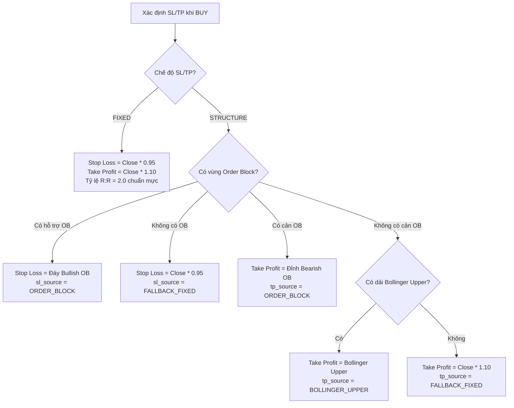

# Đặc Tả Chiến Lược Định Lượng: quality_trend_v1 (Version 1.6.0)

> **Tài liệu chuẩn hóa đặc tả kỹ thuật, điều kiện định lượng, cơ chế quản trị rủi ro và công thức toán học của hệ thống FinShield.**
> *Áp dụng cho module: `signals/strategies.py`, `signals/signal_engine.py`, `signals/risk_manager.py` và `backtesting/engine.py`.*

---

## 📌 Mục Lục

- [1. Tổng quan Chiến lược &amp; Khung thời gian](#1-tổng-quan-chiến-lược--khung-thời-gian)
- [2. Nguyên tắc Bắt buộc về Dữ liệu (Data Gate &amp; Integrity)](#2-nguyên-tắc-bắt-buộc-về-dữ-liệu-data-gate--integrity)
- [3. Chế độ Đầu tư &amp; Khẩu vị Rủi ro (Investment Horizons)](#3-chế-độ-đầu-tư--khẩu-vị-rủi-ro-investment-horizons)
- [4. Điều kiện Định lượng Tín hiệu MUA (BUY Logic)](#4-điều-kiện-định-lượng-tín-hiệu-mua-buy-logic)
- [5. Cơ chế Xác định Stop-Loss &amp; Take-Profit](#5-cơ-chế-xác-định-stop-loss--take-profit)
- [6. Điều kiện Định lượng Tín hiệu BÁN (SELL Logic) &amp; Thứ tự Ưu tiên](#6-điều-kiện-định-lượng-tín-hiệu-bán-sell-logic--thứ-tự-ưu-tiên)
- [7. Điều kiện Tín hiệu NẮM GIỮ / QUAN SÁT THÊM (HOLD Logic)](#7-điều-kiện-tín-hiệu-nắm-giữ--quan-sát-thêm-hold-logic)
- [8. Công thức Toán học Tính Điểm Độ Tự Tin (Confidence Score)](#8-công-thức-toán-học-tính-điểm-độ-tự-tin-confidence-score)
- [9. Cổng Quản trị Rủi ro Độc lập (Risk Gate Constraints)](#9-cổng-quản-trị-rủi-ro-độc-lập-risk-gate-constraints)
- [10. Quy chuẩn Dữ liệu Đầu ra (Output Data Contract)](#10-quy-chuẩn-dữ-liệu-đầu-ra-output-data-contract)

---

## 1. Tổng quan Chiến lược & Khung thời gian

- **Tên chiến lược:** `quality_trend_v1`
- **Phiên bản:** `1.6.0`
- **Triết lý giao dịch:**
  Chiến lược định lượng đa tầng kết hợp 4 trụ cột cốt lõi:
  1. **Thị trường chung (Market Context):** Xu hướng định hướng của chỉ số VN-Index / VN30.
  2. **Chất lượng nội tại (Fundamental Quality):** Sức khỏe tài chính, tỷ suất sinh lời ROE TTM và đòn bẩy an toàn.
  3. **Xu hướng & Động lượng (Trend & Momentum):** Cấu trúc đường trung bình động (MA), sức mạnh giá RSI, phân kỳ/hội tụ MACD kết hợp biên độ dải nén Bollinger Bands.
  4. **Dòng tiền Khối ngoại & Smart Money (Foreign Flow & Order Block):** Dấu chân dòng tiền tổ chức nước ngoài (5 phiên) kết hợp vùng gom/cản Order Block.
- **Khung thời gian vận hành:**
  - *Dữ liệu tính toán:* Nến ngày (`1D`) kết hợp snapshot giá khớp lệnh Realtime từng giây từ sàn DNSE.
  - *Khung giao dịch:* Swing Trading (Ngắn hạn từ vài ngày đến vài tuần) và Position Trading (Tích sản trung - dài hạn).

---

## 2. Nguyên tắc Bắt buộc về Dữ liệu (Data Gate & Integrity)

> [!IMPORTANT]
> **Nguyên tắc số 1:** *Dữ liệu không đủ tin cậy thì hệ thống KHÔNG ĐƯỢC PHÉP tạo tín hiệu BUY/SELL.*
> Dữ liệu cơ bản, chỉ số thị trường hoặc giao dịch khối ngoại bị thiếu sẽ **chặn mở vị thế BUY mới**, nhưng **tuyệt đối không được làm mất tín hiệu SELL bảo vệ vị thế** khi giá realtime vẫn còn mới và hợp lệ.

### A. Tách biệt Độc lập 3 Trạng thái

1. `data_status`: Trạng thái toàn vẹn dữ liệu từ crawler và analytics:
   - `OK`: Đầy đủ dữ liệu, không có trường bắt buộc bị null/NaN/quá hạn.
   - `DATA WARNING`: Thiếu một phần dữ liệu bổ trợ hoặc dữ liệu bị cảnh báo chất lượng.
   - `MISSING`: Mã không tồn tại hoặc hoàn toàn không có dữ liệu.
2. `signal_status`: Trạng thái sàng lọc của chiến lược:
   - `ELIGIBLE`: Dữ liệu thỏa mãn điều kiện để sinh tín hiệu giao dịch.
   - `NO SIGNAL`: Bị chặn bởi Data Gate hoặc không đủ điều kiện kỹ thuật/cơ bản.
3. `action`: Khuyến nghị thực thi:
   - `BUY` | `SELL` | `HOLD` | `NO SIGNAL`.

### B. Kiểm soát Độ mới Giá Realtime (Freshness Check)

Đối với việc bảo vệ vị thế đang mở:

- Giá realtime bắt buộc phải có giá trị dương hữu hạn: `realtime_price > 0`.
- Độ trễ giá (`realtime_age_minutes`) không được vượt quá **15 phút** (`max_position_realtime_age_minutes = 15.0`).
- Không chấp nhận mốc thời gian nằm trong tương lai: $\text{realtime\_age\_minutes} \ge -5$ phút.
- Nếu vi phạm $\rightarrow$ Lập tức trả về `NO SIGNAL` kèm lý do cảnh báo dữ liệu cũ, không đoán giá.

---

## 3. Chế độ Đầu tư & Khẩu vị Rủi ro (Investment Horizons)

Chiến lược hỗ trợ 3 chế độ đánh giá tương ứng với khẩu vị của từng nhà đầu tư (cấu hình qua `/setup` trên Telegram Bot):

| Chế độ (`investment_mode`)            | Trọng tâm phân tích                                                                | Khung thời gian         | Đặc điểm điểm vào/ra                                            |
| ------------------------------------------ | -------------------------------------------------------------------------------------- | ------------------------ | ---------------------------------------------------------------------- |
| **`SHORT_TERM`** *(Mặc định)* | Kỹ thuật, MA, RSI, MACD, Volume bùng nổ, Khối ngoại, Order Block                 | T+2.5 đến vài tuần   | Tối ưu điểm nổ động lượng, SL -5%, TP +10% (R:R$\ge 2.0$)   |
| **`LONG_TERM`**                    | Định giá P/E, P/B, ROE TTM, tỷ lệ đòn bẩy D/E, BCTC quý mới nhất            | 6 tháng đến vài năm | Tích sản vùng giá chiết khấu, SL rộng -15%, TP mục tiêu +35%  |
| **`BOTH`**                         | Đa khung thời gian: Nền tảng cơ bản vững vàng + Điểm nổ kỹ thuật tối ưu | Linh hoạt               | Tận dụng sóng tăng kỹ thuật trên cổ phiếu cơ bản xuất sắc |

---

## 4. Điều kiện Định lượng Tín hiệu MUA (BUY Logic)

Một mã cổ phiếu được kích hoạt trạng thái **BUY** khi thỏa mãn toàn bộ các điều kiện trong từng nhánh đầu tư:

### A. Phân nhánh NGẮN HẠN (`SHORT_TERM`) & ĐA KHUNG (`BOTH`)

#### Lớp 1: Trạng thái Thị trường Chung (Market Filter)

- Chỉ số VN-Index (hoặc VN30) đóng cửa nằm trên đường trung bình động 20 phiên:
  $$
  \text{Close}_{\text{VNINDEX}} > \text{SMA}_{20}(\text{VNINDEX})
  $$

#### Lớp 2: Sức khỏe Cơ bản Doanh nghiệp (Fundamental Filter)

- Tỷ suất sinh lời trên vốn chủ sở hữu 4 quý gần nhất:
  $$
  \text{ROE}_{\text{TTM}} \ge 15.0\% \quad (\text{roe\_ttm} \ge 0.15)
  $$
- Hệ số Đòn bẩy Tài chính:
  $$
  \frac{\text{Tổng Nợ Vay}}{\text{Vốn Chủ Sở Hữu}} \le 1.0 \quad (D/E \le 1.0)
  $$

  > **Quy tắc Ngoại lệ Ngành (Financial Sector Exemption):**
  > Tự động miễn trừ điều kiện $D/E \le 1.0$ cho nhóm ngành Tài chính, Ngân hàng, Chứng khoán (`banking`, `securities`, `finance`) do đặc thù mô hình kinh doanh sử dụng đòn bẩy tiền gửi/huy động cao.
  >

#### Lớp 3: Cấu trúc Xu hướng & Động lượng Kỹ thuật (Technical Filter)

- **Cấu trúc Xu hướng Tăng vững chắc:**

  $$
  \text{Close} > \text{SMA}_{20} \quad\text{và}\quad \text{SMA}_{20} > \text{SMA}_{50}
  $$
- **Động lượng Tăng trưởng Khỏe (Momentum):**

  $$
  50.0 \le \text{RSI}_{14} \le 70.0
  $$

  $$
  \text{MACD} > \text{MACD Signal}
  $$

#### Lớp 4: Dòng tiền Khối Ngoại (Foreign Flow Filter)

- Khối ngoại không ở trong trạng thái bán tháo dồn dập. Nếu dữ liệu có đủ 5 phiên gần nhất:
  $$
  \text{Không thỏa mãn đồng thời: } (\text{Foreign Net Volume}_{5D} < 0 \quad\text{và}\quad \text{Số phiên bán ròng} \ge 4/5)
  $$

#### Lớp 5: Bộ Lọc Tinh Chỉnh Chống Bẫy Giá (Confluence Filters - Mới trong v1.6.0)

1. **Chống bẫy mua rướn đỉnh dải Bollinger Bands:**
   Nếu giá vượt dải trên $\text{Close} > \text{Bollinger Upper} \times 1.01$ trong khi dải đang nén chặt ($\text{Bandwidth} < 0.08$) $\rightarrow$ **CHẶN MUA** do rủi ro mua trúng đỉnh rung lắc ngắn hạn.
2. **Xác nhận Khối lượng (Volume Confirmation - Chống Bull Trap):**
   Khối lượng phiên hiện tại phải đạt tối thiểu $80\%$ bình quân 20 phiên:
   $$
   \text{Volume Ratio}_{20D} = \frac{\text{Volume}}{\text{SMA}_{20}(\text{Volume})} \ge 0.8
   $$
3. **Dư địa tăng tới cản Order Block (Risk/Reward Optimization):**
   Nếu xuất hiện vùng cản kháng cự $\text{OB}_{\text{Resistance}}$ phía trên, khoảng cách tăng tối thiểu phải đạt $3.5\%$:
   $$
   \frac{\text{OB}_{\text{Resistance}} - \text{Close}}{\text{Close}} \ge 3.5\%
   $$

---

### B. Phân nhánh DÀI HẠN (`LONG_TERM` - Tích Sản Giá Trị)

Dành cho nhà đầu tư muốn gom tích sản cổ phiếu định giá rẻ, doanh nghiệp đầu ngành:

- Hiệu quả kinh doanh vượt trội: $\text{ROE}_{\text{TTM}} \ge 15.0\%$.
- Đòn bẩy an toàn dài hạn: $D/E \le 1.8$ (loại trừ nhóm tài chính).
- Vùng định giá hấp dẫn:
  $$
  P/E \le 16.0 \quad\text{và}\quad P/B \le 2.2
  $$
- Bộ lọc loại trừ bán tháo: Chặn giải ngân nếu cổ phiếu đang bị xả hoảng loạn ($\text{RSI}_{14} < 30$ kèm khối ngoại bán ròng $\ge 4/5$ phiên liên tiếp).
- Điểm cắt lỗ rộng: $\text{SL} = -15\%$; Mục tiêu chốt lời dài hạn: $\text{TP} = +35\%$.

---

## 5. Cơ chế Xác định Stop-Loss & Take-Profit

Hệ thống cho phép người dùng tùy chỉnh cơ chế tính SL/TP (qua lệnh `/settings` trên bot):



---

## 6. Điều kiện Định lượng Tín hiệu BÁN (SELL Logic) & Thứ tự Ưu tiên

### A. Đối với Vị Thế Đang Mở (`PositionContext.has_position = True`)

Khi một cổ phiếu đã được mua và đang được theo dõi trong danh mục, hệ thống quét điều kiện đóng lệnh theo **thứ tự ưu tiên bất biến** sau đây:

|  Thứ tự  | Trigger                        | Điều kiện định lượng                                                  | Giải thích nghiệp vụ                                                                                                                                                                                   |
| :---------: | ------------------------------ | ---------------------------------------------------------------------------- | ---------------------------------------------------------------------------------------------------------------------------------------------------------------------------------------------------------- |
| **1** | **`STOP_LOSS`**        | $\text{Session Low} \le \text{Stop Loss}$                                  | **Ưu tiên số 1:** Cắt lỗ bảo vệ vốn tuyệt đối (thường là $-5\%$ so với giá vốn). Trong backtest, nếu cả SL và TP cùng bị chạm trong 1 phiên, luôn kích hoạt SL trước. |
| **2** | **`TAKE_PROFIT`**      | $\text{Session High} \ge \text{Take Profit}$                               | **Chốt lời theo mục tiêu:** Đạt mức kỳ vọng $+10\%$ (hoặc kháng cự Order Block).                                                                                                       |
| **3** | **`TREND_EXIT`**       | $\text{SMA}_{20} < \text{SMA}_{50}$                                        | **Gãy cấu trúc sóng:** Đường trung bình ngắn hạn cắt xuống trung bình trung hạn.                                                                                                       |
| **4** | **`MARKET_EXIT`**      | $\text{Close}_{\text{VNINDEX}} \le \text{SMA}_{20}(\text{VNINDEX})$        | **Thị trường chung sụp đổ:** VN-Index đóng cửa gãy mốc hỗ trợ SMA20.                                                                                                                    |
| **5** | **`FOREIGN_NET_SELL`** | $\text{Foreign Net Volume}_{5D} < 0$ và có $\ge 3/5$ phiên bán ròng | **Khối ngoại phân phối dồn dập:** Dòng tiền tổ chức rút vốn liên tục.                                                                                                                  |

---

### B. Đối với Quét Tín Hiệu Thị Trường Toàn Bộ (Chưa Có Vị Thế)

Hệ thống nhận diện các mẫu hình nguy hiểm để phát tín hiệu cảnh báo BÁN / HẠ TỶ TRỌNG:

1. **Gãy cấu trúc xu hướng:**
   $$
   \text{Close} < \text{SMA}_{20} < \text{SMA}_{50} \quad\text{kèm}\quad \text{MACD} < \text{Signal}
   $$
2. **Gãy dải dưới Bollinger Bands có xác nhận (Confirmed Breakdown):**$\text{Close} < \text{Bollinger Lower}$ kèm một trong các yếu tố:
   - Khối ngoại bán ròng áp đảo ($\ge 4/5$ phiên bán ròng, tổng âm) khi giá dưới $\text{SMA}_{20}$.
   - Dải Bollinger đang mở rộng ($\text{Bandwidth} \ge 8\%$) kèm $\text{RSI} < 45$ và $\text{MACD} < \text{Signal}$.
   - Thủng đồng thời đáy hỗ trợ Order Block ($\text{Close} < \text{OB}_{\text{Support}}$).
3. **Thủng đáy vùng gom hàng Bullish Order Block:**$\text{Close} < \text{OB}_{\text{Support}}$ kèm $\text{Close} < \text{SMA}_{20}$ hoặc $\text{MACD} < \text{Signal}$.
4. **Đảo chiều tại vùng cản kháng cự quá mua:**Giá chạm hoặc tiệm cận cản $\text{OB}_{\text{Resistance}}$ (hoặc dải trên Bollinger) trong trạng thái quá mua ($\text{RSI} > 70$ hoặc $\text{Stochastic \%K} > 80$) kèm $\text{MACD}$ đảo chiều cắt xuống dưới $\text{Signal}$.
5. **Tiêu chuẩn BÁN Dài Hạn (`LONG_TERM`):**
   Định giá bong bóng ($P/E \ge 28.0$), đòn bẩy phình to nguy hiểm ($D/E > 2.5$), hoạt động kinh doanh thua lỗ ($\text{ROE}_{\text{TTM}} < 0$), hoặc khối ngoại bán ròng 5 phiên liên tiếp khi giá thủng $\text{SMA}_{20}$.

---

## 7. Điều kiện Tín hiệu NẮM GIỮ / QUAN SÁT THÊM (HOLD Logic)

Trạng thái **HOLD** được kích hoạt khi cổ phiếu **chưa đủ điều kiện BUY và chưa vi phạm điều kiện SELL**.

Hệ thống bóc tách khuyến nghị minh bạch theo 3 trụ cột:

1. **Trụ cột Xu hướng & MA:** Phân tích vị thế giá so với $\text{SMA}_{20}$ và $\text{SMA}_{50}$.
2. **Trụ cột Động lượng:** Đánh giá vùng tích lũy RSI (Quá mua $>70$, Quá bán $<30$, hay Trung tính $30-70$) và vị trí MACD so với Signal line.
3. **Trụ cột Dòng tiền Khối ngoại:** Thống kê khối lượng mua/bán ròng 5 phiên và tỷ lệ phiên gom hàng.
4. **Điểm nghẽn cần theo dõi:** Chỉ rõ nguyên nhân chưa thể giải ngân BUY (ví dụ: Chờ thanh khoản bùng nổ, Chờ VNINDEX vượt SMA20, hoặc Chờ RSI bứt phá).
5. **Cảnh báo Chống Bán Tháo Hoảng Loạn (Anti-Panic Sell Safeguard):**
   - Nếu giá chạm/thủng dải dưới Bollinger Bands trong lúc dải đang nén chặt hoặc thiếu xác nhận bán tháo $\rightarrow$ Cảnh báo tiềm ẩn nhịp hồi phục kỹ thuật (**Mean Reversion**), khuyên nhà đầu tư giữ vị thế, không bán tháo tại đáy nến.
   - Nếu $\text{RSI}_{14} \le 32$ rơi vào vùng quá bán sâu $\rightarrow$ Nhắc nhở theo dõi phản ứng lực cầu rút chân.

---

## 8. Công thức Toán học Tính Điểm Độ Tự Tin (Confidence Score)

Đối với tín hiệu `BUY`, điểm độ tự tin $S \in [0, 100]$ được tính dựa trên mô hình trọng số đa nhân tố:

$$
S = 100 \times \Big( 0.20 \cdot M + 0.25 \cdot F + 0.35 \cdot T + 0.20 \cdot FF \Big)
$$

Trong đó:

- $M \in [0, 1]$: Market Score (Điểm thị trường chung VN-Index).
- $F \in [0, 1]$: Fundamental Score (Điểm cơ bản doanh nghiệp).
- $T \in [0, 1]$: Technical Score (Điểm kỹ thuật xu hướng & động lượng).
- $FF \in [0, 1]$: Foreign Flow Score (Điểm dòng tiền khối ngoại).

### Chi tiết các Hàm Thành phần:

Hàm chuẩn hóa biên độ an toàn (`_margin_score`):

$$
\text{Margin}(x, \text{base}, m) = \text{clamp}\left(0.5 + 0.5 \times \frac{\frac{x}{\text{base}} - 1}{m}\right)
$$

*(Với $\text{clamp}(v) = \max(0.0, \min(1.0, v))$)*

#### 1. Market Score ($M$):

$$
M = \text{Margin}\Big(\text{Close}_{\text{Index}},\, \text{SMA}_{20}(\text{Index}),\, 0.05\Big)
$$

#### 2. Fundamental Score ($F$):

$$
S_{\text{ROE}} = \text{clamp}\left(\frac{\text{ROE}_{\text{TTM}}}{0.30}\right)
$$

$$
S_{\text{Debt}} = 1.0 \quad \text{(nếu thuộc ngành tài chính)}, \quad \text{ngược lại} = \text{clamp}\left(1.0 - \frac{D/E}{2.0}\right)
$$

$$
F = \frac{S_{\text{ROE}} + S_{\text{Debt}}}{2}
$$

#### 3. Technical Score ($T$):

$$
S_{\text{Price}} = \text{Margin}\big(\text{Close},\, \text{SMA}_{20},\, 0.10\big)
$$

$$
S_{\text{Trend}} = \text{Margin}\big(\text{SMA}_{20},\, \text{SMA}_{50},\, 0.10\big)
$$

$$
S_{\text{RSI}} = \text{clamp}\left(1.0 - \frac{|\text{RSI}_{14} - 60.0|}{20.0}\right)
$$

$$
\text{Scale}_{\text{MACD}} = \max\big(|\text{Close}| \times 0.02,\, 10^{-9}\big)
$$

$$
S_{\text{MACD}} = \text{clamp}\left(0.5 + 0.5 \times \frac{\text{MACD} - \text{Signal}}{\text{Scale}_{\text{MACD}}}\right)
$$

$$
T = \frac{S_{\text{Price}} + S_{\text{Trend}} + S_{\text{RSI}} + S_{\text{MACD}}}{4}
$$

#### 4. Foreign Flow Score ($FF$):

$$
S_{\text{Session}} = \frac{\text{Số phiên mua ròng}}{5}
$$

$$
S_{\text{Strength}} = \text{clamp}\left(0.5 + 0.5 \times \frac{\text{Net Volume}_{5D}}{\text{Tổng Mua} + \text{Tổng Bán}}\right) \quad\text{(nếu có tổng khối lượng)}
$$

$$
FF = \frac{S_{\text{Session}} + S_{\text{Strength}}}{2}
$$

---

## 9. Cổng Quản trị Rủi ro Độc lập (Risk Gate Constraints)

Mọi tín hiệu `BUY` sinh ra từ `QualityTrendStrategy` bắt buộc phải được thẩm định qua `RiskGate` (`signals/risk_manager.py`) trước khi gửi tới người dùng.

Nếu vi phạm bất kỳ điều kiện nào sau đây, tín hiệu sẽ bị **`BLOCK`**:

1. **Kiểm tra Dữ liệu & Trạng thái:** Chỉ cho phép khi `data_status == "OK"` và `signal_status == "ELIGIBLE"`.
2. **Bắt buộc Stop-Loss:** Không có mức cắt lỗ rõ ràng $\rightarrow$ `BLOCK`.
3. **Tỷ lệ Lợi nhuận / Rủi ro Tối thiểu (Reward/Risk Ratio):**
   $$
   \text{RR} = \frac{\text{Take Profit} - \text{Reference Price}}{\text{Reference Price} - \text{Stop Loss}} \ge 2.0
   $$

   *(Nếu $\text{RR} < 2.0 \rightarrow$ `BLOCK` do không bù đắp được rủi ro)*.
4. **Thời gian Chờ Tín hiệu (Cooldown Period):**
   Chặn lặp lại tín hiệu BUY cùng một mã trong vòng **$3,600$ giây (1 giờ)** kể từ lần duyệt gần nhất.
5. **Giới hạn Số lượng Vị thế Mở (Max Open Positions):**
   Tối đa **10 vị thế** mở đồng thời trong danh mục.
6. **Cổng Thanh khoản (Liquidity Gate):**
   - Giá trị giao dịch trung bình 20 phiên tối thiểu: $\ge 5,000,000,000$ VNĐ (5 tỷ đồng).
   - Tỷ lệ tham gia lệnh tối đa: Khối lượng lệnh dự kiến không vượt quá $10\%$ khối lượng giao dịch bình quân 20 phiên.
   - Tuân thủ quy chuẩn lô chẵn 100 cổ phiếu trên sàn HOSE/HNX.
7. **Bảo vệ Danh mục Tài khoản (Drawdown Protection):**
   - Giới hạn mức lỗ tối đa trong ngày: $\le 3\%$ tổng tài sản (NAV).
   - Giới hạn mức sụt giảm tối đa từ đỉnh tài khoản: $\le 10\%$ Max Drawdown.

---

## 10. Quy chuẩn Dữ liệu Đầu ra (Output Data Contract)

Tín hiệu xuất ra từ `SignalEngine` tuân thủ nghiêm ngặt dataclass `SignalEvent`:

```json
{
  "signal_id": "8f3b2a10-e591-4a7b-a2c9-94819201ab45",
  "symbol": "FPT",
  "strategy": "quality_trend_v1",
  "strategy_version": "1.6.0",
  "action": "BUY",
  "confidence": 84.75,
  "reference_price": 112500.0,
  "stop_loss": 106875.0,
  "take_profit": 123750.0,
  "reasons": [
    "Tất cả các điều kiện BUY kỹ thuật & xu hướng đều thỏa mãn!",
    "Chiến lược Xu hướng & MA: Giá (112,500) > SMA20 (108,000) > SMA50 (104,000) — Xác nhận sóng tăng.",
    "Chiến lược Động lượng (RSI & MACD): RSI(14) = 62.5 chuẩn đà tăng | MACD (1.450) cắt lên trên Signal (1.120).",
    "Chiến lược Dòng tiền Khối ngoại: Mua ròng +4,500,000 cp (4/5 phiên) hỗ trợ lực cầu."
  ],
  "data_as_of": "2026-09-22T13:45:00+07:00",
  "data_status": "OK",
  "signal_status": "ELIGIBLE",
  "sector": "Cong nghe thong tin",
  "component_scores": {
    "market": 0.8500,
    "fundamental": 0.9000,
    "technical": 0.8250,
    "foreign_flow": 0.8000
  },
  "metadata": {
    "investment_mode": "SHORT_TERM",
    "sl_tp_mode": "STRUCTURE",
    "sl_source": "ORDER_BLOCK",
    "tp_source": "ORDER_BLOCK",
    "ob_support": 107000.0,
    "ob_resistance": 124000.0,
    "foreign_net_volume_5d": 4500000,
    "foreign_net_buy_sessions_5d": 4,
    "user_sl_pct": 0.05,
    "user_tp_pct": 0.10
  }
}
```

---

<div align="center">
